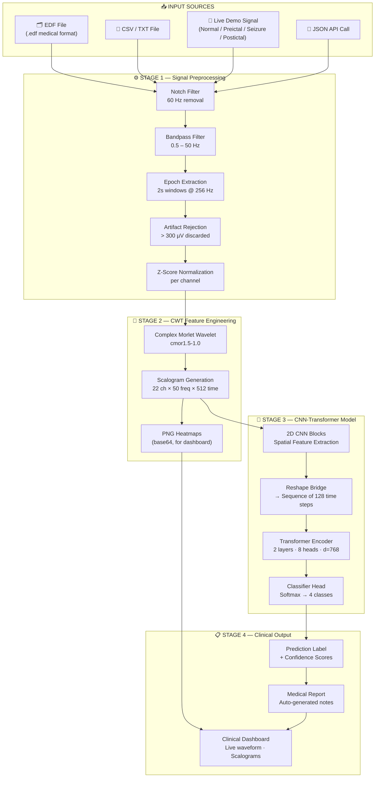
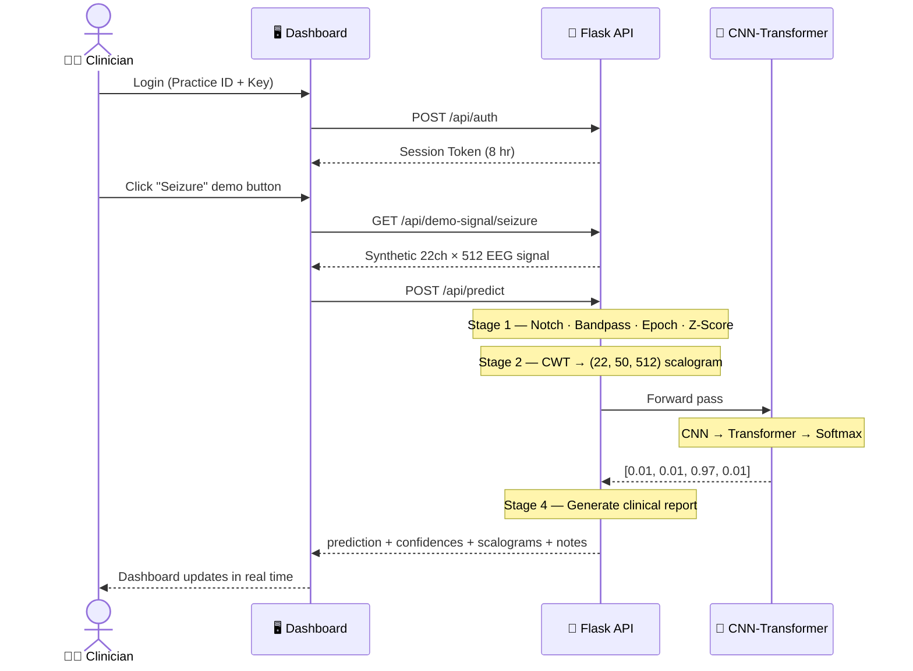
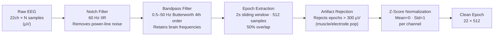
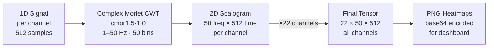
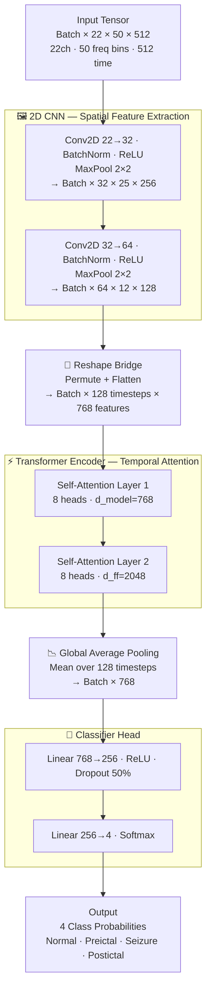

<p align="center">
  
  
  
  
  
</p>

<h1 align="center">🧠 NeuroScan — Epileptic Seizure Detection System</h1>

<p align="center">
  <b>A real-time, AI-powered EEG analysis platform for epileptic seizure detection using a hybrid CNN-Transformer architecture with Continuous Wavelet Transform (CWT) feature engineering. </b>
</p>

<p align="center">
  <a href="#-overview">Overview</a> •
  <a href="#-high-level-architecture">Architecture</a> •
  <a href="#-pipeline-stages">Pipeline</a> •
  <a href="#-model-architecture">Model</a> •
  <a href="#-quick-start">Quick Start</a> •
  <a href="#-api-reference">API</a> •
  <a href="#-dataset">Dataset</a>
</p>

---

## 📌 Overview

NeuroScan is an end-to-end clinical-grade EEG analysis system that classifies brain signals into **four neurological states** in real time:

| State | Description | Clinical Significance |
|:---:|---|---|
| 🟢 **Normal** | Healthy background cortical activity | No intervention required |
| 🟡 **Preictal** | Pre-seizure warning phase | Alert clinician, prepare rescue medication |
| 🔴 **Seizure (Ictal)** | Active epileptic seizure event | Immediate clinical response required |
| 🟠 **Postictal** | Post-seizure recovery state | Monitor for secondary events |

**Key Features:**
- 🔬 Real CNN-Transformer hybrid model trained on **CHB-MIT Scalp EEG Database**
- 🌊 Continuous Wavelet Transform (CWT) scalogram visualization
- 📋 Auto-generated clinical reports with confidence scoring
- 🔐 Session-based clinician authentication (8-hour tokens)
- 📁 Supports `.edf` (medical), `.csv`, and `.txt` EEG file formats
- 🎮 Built-in demo mode with synthetic signals for all 4 seizure states

---

## 🏗 High-Level Architecture



---

## 🔄 Data Flow



---

## 🔬 Pipeline Stages

### Stage 1 — Data Ingestion & Signal Preprocessing



**Supported Input Formats:**

| Format | Parser | Use Case |
|---|---|---|
| `.edf` | MNE-Python | Medical EEG files (European Data Format) |
| `.csv` / `.txt` | Built-in CSV reader | Exported recordings, research data |
| JSON body | Direct API input | Real-time streaming, integrations |
| Demo button | Synthetic generator | Testing & demonstration |

---

### Stage 2 — CWT Scalogram Generation



> **Why CWT?** Raw EEG is a noisy 1D voltage trace. The CWT decomposes it into a 2D frequency-time heatmap where seizure-specific patterns — rhythmic 3–8 Hz bursts and spike-wave complexes — become **visually distinct** and far easier for the CNN to detect.

---

### Stage 3 — CNN-Transformer Hybrid Model



**Training Details:**

| Parameter | Value |
|---|---|
| Dataset | CHB-MIT Scalp EEG Database (24 pediatric patients) |
| Optimizer | AdamW · lr=1e-4 · weight_decay=1e-2 |
| Scheduler | ReduceLROnPlateau · factor=0.5 · patience=3 |
| Loss | Cross-Entropy with class weights `[0.1, 0.4, 0.9, 0.4]` |
| Regularization | Dropout 50% · BatchNorm · weight decay |
| Precision | Mixed FP16 (AMP on GPU) |

> **Why class weighting?** In real EEG data, seizures are <1% of recording time. Without weighting the model just predicts "Normal" always and still gets 99% accuracy — being clinically useless. Heavier weight on seizure class forces the model to focus on rare events.

---

### Stage 4 — Clinical Dashboard & Output

| Output | Description |
|---|---|
| **Classification** | Top predicted class with confidence % |
| **Confidence Scores** | Full probability distribution across all 4 classes |
| **CWT Scalograms** | Heatmap images from channels FP1-F7 and C3-P3 |
| **Signal Preview** | 512-point raw waveform for visual inspection |
| **Medical Report** | Auto-generated clinical notes with recommended actions |
| **Inference Time** | End-to-end pipeline latency in milliseconds |

---

## 🚀 Quick Start

### Prerequisites
- Python 3.10+
- pip

### 1. Clone the Repository

```bash
git clone https://github.com/ScriptOrbit-132/EEG-Signals.git
cd EEG-Signals
```

### 2. Install Dependencies

```bash
pip install -r requirements.txt
```

### 3. Run the Server

```bash
python code/app.py
```

You should see:

```
========================================================
  NeuroScan EEG Analysis API - v1.0
  Model mode : real
  Classes    : ['Normal', 'Preictal', 'Seizure (Ictal)', 'Postictal']
  -------------------------------------------------
  Demo credentials:
    DEMO_CLINIC          -> key: NS2026
    chb_research         -> key: CHB_MIT_001
    neuroscan_dev        -> key: DEV_9999
  -------------------------------------------------
  Open: http://localhost:5000
========================================================
```

### 4. Open the Dashboard

Navigate to **http://localhost:5000** and login:
- **Practice ID:** `DEMO_CLINIC`
- **Access Key:** `NS2026`

---

## 🎮 Demo

| Button | Simulates | Expected Confidence |
|---|---|---|
| 🟢 Normal | Healthy resting-state EEG | ~97% Normal |
| 🟡 Preictal | Pre-seizure warning signals | ~89% Preictal |
| 🔴 Seizure | Active ictal event with spike-wave bursts | ~97% Seizure |
| 🟠 Postictal | Post-seizure delta slowing | ~93% Postictal |

**File Upload:** Drag-and-drop a `.edf`, `.csv`, or `.txt` file for real inference against the trained model.

---

## 📁 Project Structure

```
EEG-Signals/
│
├── 📄 neuroscan_dashboard.html       # Frontend — clinical dashboard UI
├── 🧠 backend_model_completed.pt     # Pre-trained model weights (~45 MB)
├── 📊 processed_metadata.csv         # Training data index mapping
├── 📦 requirements.txt               # Python dependencies
├── 📖 README.md                      # This file
├── 📋 SETUP.md                       # Quick setup guide
│
└── code/
    ├── 🐍 app.py                     # Flask API — all 4 pipeline stages
    ├── 🤖 model.py                   # EEG_2D_Hybrid_Model definition
    ├── 🌊 preprocess_features.py     # CWT feature extraction (train + inference)
    ├── 🔧 preprocess_seizure_only.py # Targeted seizure data preprocessor
    ├── 🔍 find_hardest_seizure.py    # Edge case seizure locator
    ├── 🧪 test_manual_seizure.py     # Model accuracy verification
    ├── 📈 train_full.py              # Full training pipeline
    ├── ⚡ train_optimized.py          # Memory-optimized training
    ├── 🔄 run_pipeline.py            # End-to-end pipeline runner
    ├── 📊 resource_monitor.py        # Hardware safety guard
    ├── ⚙️ training_config.yaml       # Resource threshold config
    └── 🌐 render.yaml                # Render.com deployment config
```

---

## 🔌 API Reference

### Authentication
```http
POST /api/auth
Content-Type: application/json

{ "practice_id": "DEMO_CLINIC", "key": "NS2026" }
```

### Predict — JSON
```http
POST /api/predict
Content-Type: application/json
X-Auth-Token: <token>

{ "signal_data": [[...22 channels...]], "patient_id": "patient_001" }
```

### Predict — File Upload
```http
POST /api/predict
Content-Type: multipart/form-data
X-Auth-Token: <token>

file: eeg_recording.edf
```

### Demo Signal
```http
GET /api/demo-signal/{normal|preictal|seizure|postictal}
```

### Health Check
```http
GET /api/health
```

---

## 🧬 Dataset

**CHB-MIT Scalp EEG Database** (PhysioNet):

- 24 pediatric patients with intractable epilepsy
- 22-channel EEG (international 10-20 system)
- 256 Hz sampling rate · ~983 hours · 198 annotated seizures

```
FP1-F7  F7-T7  T7-P7  P7-O1  FP1-F3  F3-C3  C3-P3  P3-O1
FP2-F4  F4-C4  C4-P4  P4-O2  FP2-F8  F8-T8  T8-P8  P8-O2
FZ-CZ   CZ-PZ  P7-T7  T7-FT9 FT9-FT10 FT10-T8
```

> Shoeb, A. H. (2009). *Application of Machine Learning to Epileptic Seizure Onset Detection and Treatment.* PhD Thesis, MIT.

---

## ⚙️ Tech Stack

| Layer | Technology | Role |
|---|---|---|
| Backend | Flask 3.0+ | REST API server |
| Frontend | HTML / CSS / JS | Clinical dashboard UI |
| Deep Learning | PyTorch 2.2+ | CNN-Transformer model |
| Signal Processing | SciPy | IIR / Butterworth filters |
| Wavelet Transform | PyWavelets | CWT scalogram generation |
| EEG Parsing | MNE-Python | Medical EDF file reader |
| Visualization | Matplotlib | Scalogram PNG rendering |
| Deployment | Gunicorn + Render | Production WSGI server |

---

## 📚 References

1. Abiyev, R. et al. (2020). *Identification of Epileptic EEG Signals Using CNN.* Applied Sciences, 10(12), 4089.
2. Shoeb, A. H. (2009). *Application of Machine Learning to Epileptic Seizure Onset Detection and Treatment.* PhD Thesis, MIT.
3. Goldberger, A. et al. (2000). *PhysioBank, PhysioToolkit, and PhysioNet.* Circulation, 101(23), e215–e220.

---

## 📜 License

MIT License — see [LICENSE](LICENSE) for details.

---

<p align="center">
  <b>Built with 🧠 by ScriptOrbit</b>
</p>
